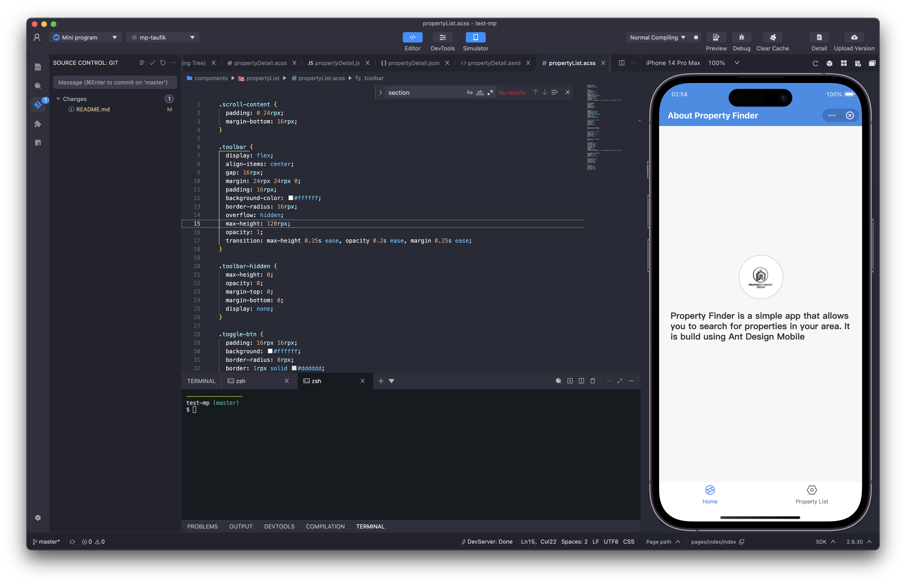
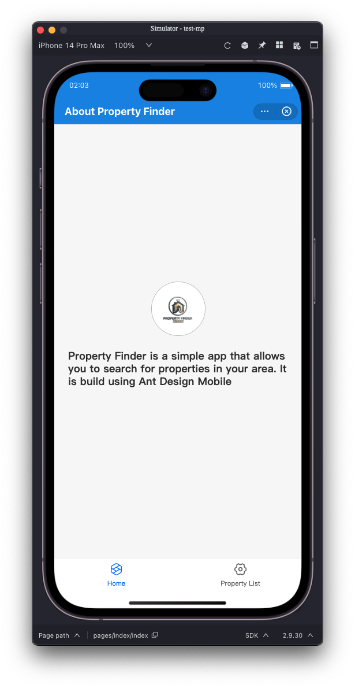
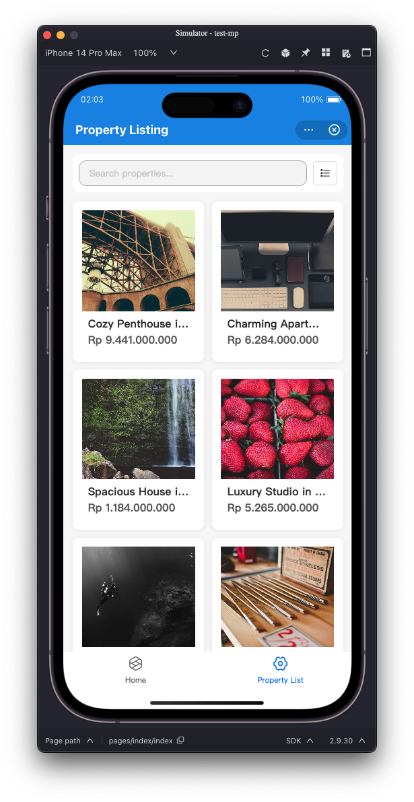
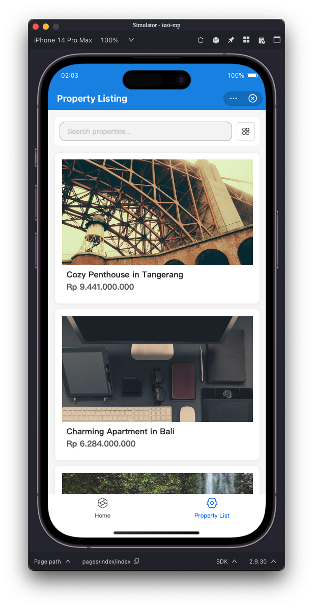
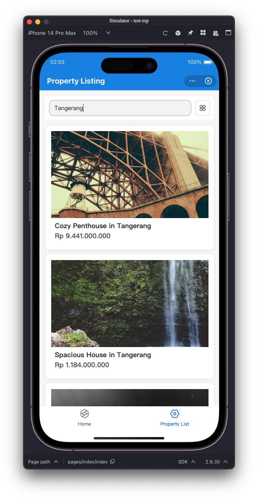
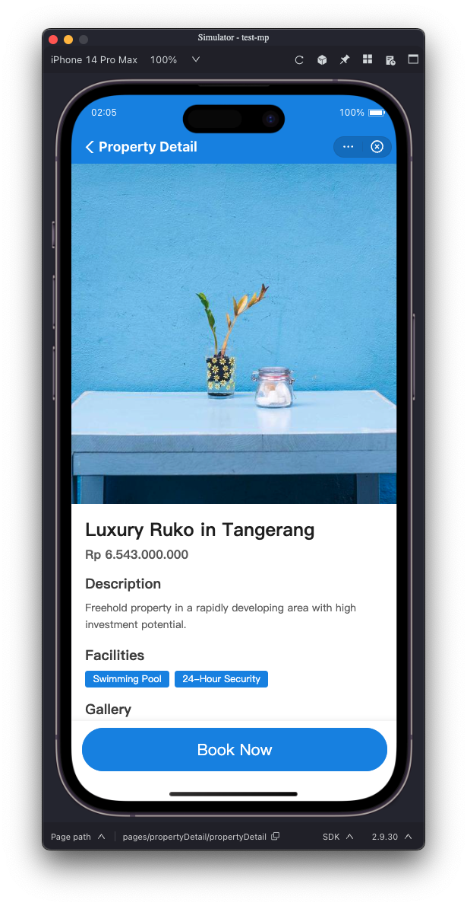
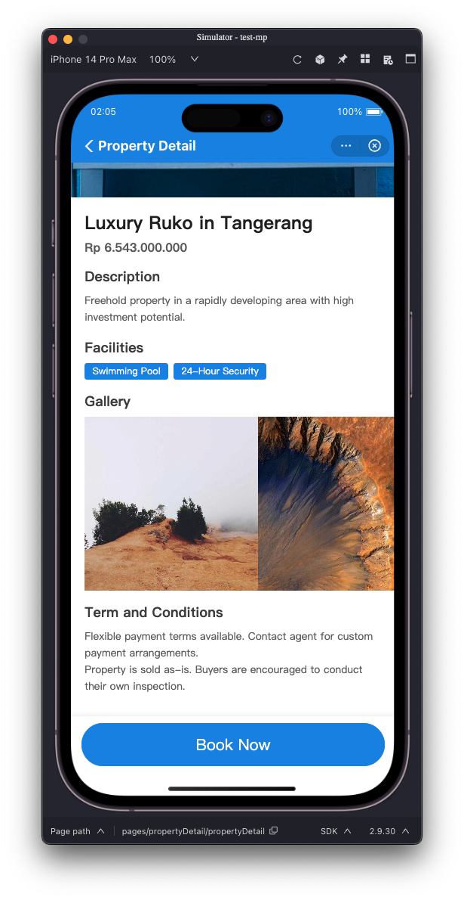

# Property Finder Mini Program

A property listing app built as a fullstack coding test. The backend is a REST API written in Go, and the frontend is an Dana mini program.

---

## Tech Stack

- **Backend:** Go, Gin, GORM, PostgreSQL
- **Frontend:** Dana Mini Program, antd-mini

---

## Demo

**Video**

[](demo/video/taufik_mini-program-dana-demo.mp4)

**Screenshots**

| Home | Property List | Property Grid |
|------|--------------|--------|
|  |  |  |

| Search by property name | Pull to refresh |
|--------------|-----------|
|  |  |

| Property Detail |
|--------------|
 |

---

## Prerequisites

Make sure you have these installed before starting:

- Go 1.21+
- Docker + Docker Compose
- Node.js + npm (for the mini program dependencies)
- [Dana Mini Program Studio](https://mini-program.dana.id/docs/miniprogram_dana/mpdev/mini-program-studio_overview) — required to run the mini program

---

## Backend Setup

The backend lives in the `backend-mp/` folder. Docker is the easiest way to get it running — no need to install PostgreSQL separately.

**1. Set up environment variables**

```bash
cd backend-mp
make prepare
```

This copies `env.example` to `.env`. Then open `.env` and change `DB_HOST` to `postgres` so the app connects to the database container:

```env
DB_HOST=postgres
```

Everything else in `.env` can stay as-is.

**2. Start the containers**

```bash
make docker-build
make docker-up
```

This spins up the app and a PostgreSQL 16 container together.

**3. Run migrations and seed data**

Wait a few seconds for the database to be ready, then:

```bash
make migrate
make seed
```

`migrate` creates the database tables, and `seed` fills them with 100 sample property listings. The API will be available at `http://localhost:8080` — hit `GET /health` to confirm it's running.

**4. Useful commands**

```bash
make docker-logs   # tail app logs
make docker-down   # stop everything
```

> If you'd rather run without Docker, you'll need PostgreSQL installed locally. Create a database named `backend_mp`, keep `DB_HOST=localhost` in `.env`, then run `make migrate`, `make seed`, and `make run` (or `make dev` for hot reload).

---

## Mini Program Setup

The mini program lives in the `test-mp/` folder and needs to be opened in Dana DevTools.

**1. Install dependencies**

```bash
cd test-mp
npm install
```

**2. Check the API base URL**

Open `test-mp/config/index.js` and make sure it points to your running backend:

```js
export const API_BASE_URL = 'http://localhost:8080';
```

If your backend is on a different port or host, update it here.

**3. Open in Dana DevTools**

- Launch Dana DevTools
- Click **Open Project** and select the `test-mp/` folder
- The mini program should load with the property listing interface

> The mini program has two pages: a home/about page and the property listing page where you can browse and search properties.

---

## API Endpoints

All routes are prefixed with `/api/v1`.

| Method | Path | Description |
|--------|------|-------------|
| GET | `/api/v1/properties` | List properties (supports `page`, `pageSize`, `keyword`) |
| GET | `/api/v1/properties/:id` | Get property by UUID |
| GET | `/api/v1/properties/doc/:documentId` | Get property by document ID (e.g. `PROP-001`) |
| POST | `/api/v1/properties` | Create a new property |
| PUT | `/api/v1/properties/:id` | Update a property |
| DELETE | `/api/v1/properties/:id` | Delete a property |

---

## Project Structure

```
.
├── backend-mp/          # Go REST API
│   ├── cmd/
│   │   ├── api/         # Server entry point
│   │   ├── migrate/     # Database migration runner
│   │   └── seed/        # Sample data seeder
│   ├── internal/        # Application logic (clean architecture)
│   ├── pkg/             # Shared packages (config, database)
│   ├── env.example      # Environment variable template
│   └── Makefile         # All the commands you need
│
└── test-mp/             # Dana mini program
    ├── pages/           # App pages
    ├── components/      # Reusable UI components
    ├── repositories/    # API calls
    ├── usecases/        # Business logic
    ├── config/          # API base URL config
    └── utils/           # Request helper, formatting
```
